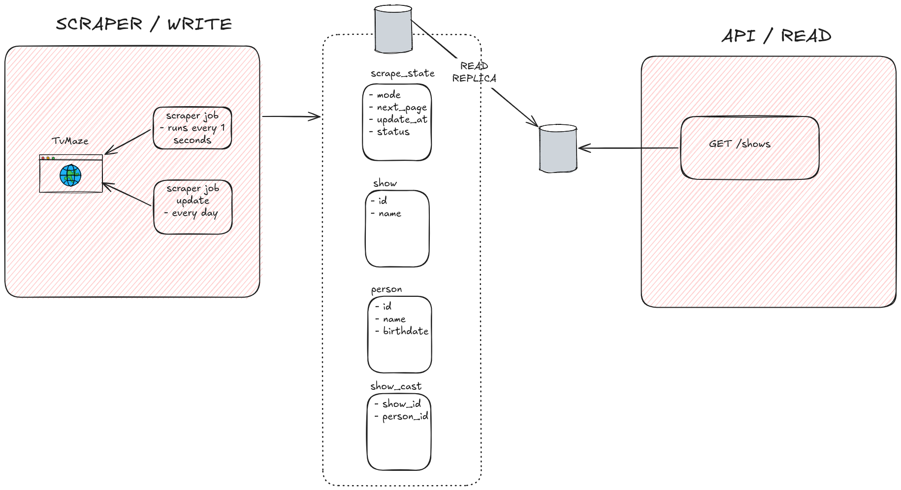

# TVMaze scraper + REST API

Scrapes shows and cast from the [TVMaze API](https://www.tvmaze.com/api) into Postgres and serves them over REST.



## Run

```bash
docker compose up -d        # Postgres primary (5432) + read replica (5433)
./gradlew bootRun           # starts the scraper job and the API
```

Set `DB_REPLICA_URL=jdbc:postgresql://localhost:5433/tvmaze` to make the API read from the replica.
The first full crawl takes many hours (one cast request per show); it resumes from its checkpoint after a restart.

## API

`GET /shows?page=1&size=20` returns shows (by id) with their cast ordered by birthday, newest first, unknown birthdays last. `size` is 1 to 100.

## Test

```bash
./gradlew test              # needs Docker (Testcontainers)
```
